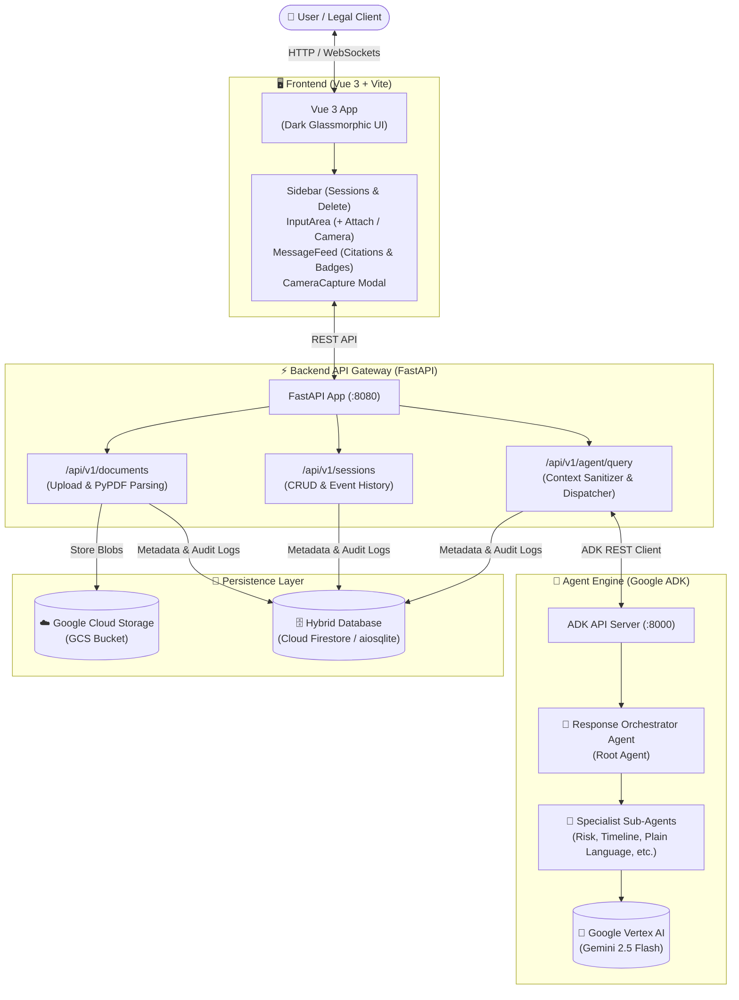
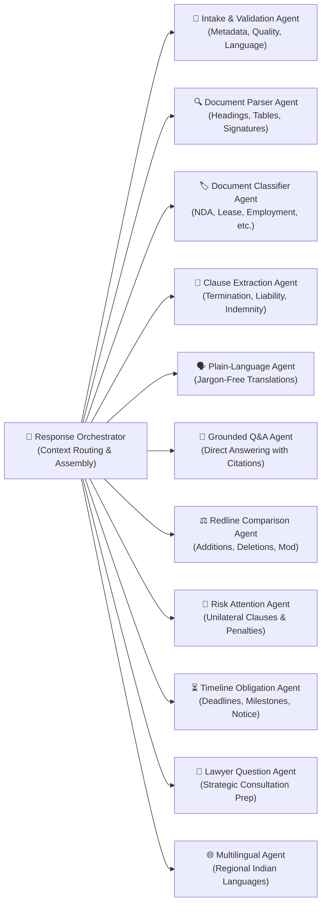

# ⚖️ LegalLens — Agentic AI Legal Consultation & Contract Analysis

LegalLens is an enterprise-grade, multi-agent AI copilot designed to demystify complex legal contracts, pinpoint high-risk clauses, extract chronological timelines & deadlines, and generate plain-language summaries and strategic lawyer consultation checklists.

Powered by **Google Agent Development Kit (ADK)**, **Gemini 2.5 Flash on Vertex AI**, **FastAPI**, **Google Cloud Storage (GCS)**, **Cloud Firestore** (with resilient local SQLite fallback), and a **Vue 3** interface.

---

## 🏛️ System Architecture



---

## 🤖 Multi-Agent Orchestration Hierarchy

LegalLens structures complex legal analysis across specialized sub-agents coordinated by a central orchestrator. Each specialist adheres to strict legal disclaimers and non-hallucination groundings with clause/page citations:



### Specialist Agent Responsibilities

| # | Agent | Primary Responsibility |
|---|---|---|
| 1 | **Response Orchestrator Agent** | Evaluates user prompts, dispatches to specialist agents, and combines structured responses. |
| 2 | **Document Intake Agent** | Validates uploaded files (PDF, images, text), checking completeness, format, and language. |
| 3 | **OCR & Document Parser Agent** | Extracts structured text page-by-page (`pypdf`), preserving paragraph numbering and sections. |
| 4 | **Legal Document Classifier Agent** | Identifies legal agreement types (Lease/Rental, NDA, Employment, Master Services, Loan, etc.). |
| 5 | **Legal Clause Extraction Agent** | Detects and tags key clauses (Indemnity, Governing Law, Non-Compete, Termination, Confidentiality). |
| 6 | **Plain-Language Explanation Agent** | Translates convoluted legal jargon into clear, digestible, consumer-friendly English. |
| 7 | **Grounded Document Q&A Agent** | Answers questions strictly using evidence from uploaded documents; prevents hallucination. |
| 8 | **Contract Comparison Agent** | Performs redline analysis across versions, identifying additions, omissions, and alterations. |
| 9 | **Risk & Red-Flag Attention Agent** | Evaluates exposure, uncapped liabilities, one-sided termination clauses, and hidden penalties. |
| 10 | **Timeline & Obligation Agent** | Builds chronological tables of notice timeframes, renewal dates, payment terms, and milestones. |
| 11 | **Lawyer Consultation Agent** | Generates strategic, prioritized questions to ask during formal legal counsel consultations. |
| 12 | **Indian Regional Language Agent** | Translates and explains clauses in Hindi, Tamil, Telugu, Kannada, Bengali, and Marathi. |

---

## ✨ Key Features

- **Multimodal Document Ingestion**:
  - Direct file upload for digital contracts (PDF, DOCX, TXT).
  - Built-in **"Snap with Camera"** feature to capture physical paper contracts directly from your webcam.
- **Robust PDF Parsing Engine**:
  - Integrated `pypdf` page-level extraction (`[Page 1] ... [Page 2] ...`) with dynamic fallback to prevent raw binary leaks to LLMs.
- **Comprehensive Session Management**:
  - Interactive sidebar for consultation history.
  - New consultation creation with contextual active document binding.
  - **Consultation Deletion**: Small, interactive trash icon on each chat session with synchronized backend & ADK cleanup.
- **Enterprise-Grade Cloud Integration**:
  - Files securely stored in **Google Cloud Storage (GCS)** (`gs://legallens-documents-509417`).
  - Session metadata and event audit trails persisted in **Google Cloud Firestore**, with an automatic resilient local **aiosqlite** fallback (`legallens.db`).
- **Grounded Evidence & Legal Disclaimer**:
  - Every agent response includes precise page/paragraph citations and prominent non-attorney advisory disclaimers.

---

## 🛠️ Tech Stack

- **AI & Agent Orchestration**: Google Agent Development Kit (ADK), Google GenAI SDK, Google Vertex AI (`gemini-2.5-flash`), Python 3.14.
- **Backend API Gateway**: FastAPI, Uvicorn, Pydantic v2, Google Cloud Storage Client, Google Cloud Firestore Client, aiosqlite, PyPDF, HTTPX.
- **Frontend Application**: Vue 3 (Composition API `<script setup>`), Vite, Lucide Vue Next icons, Vanilla CSS design tokens (Dark glassmorphic theme).

---

## 📁 Project Structure

```
legalLens/
├── README.md                           # Comprehensive documentation
├── agent/                              # Google ADK Multi-Agent Package
│   ├── legallens/
│   │   ├── __init__.py
│   │   ├── agent.py                    # Multi-agent tree and root orchestrator setup
│   │   ├── prompts.py                  # Prompts and legal guardrails for all 12 agents
│   │   └── .env                        # Vertex AI enterprise configuration
│   └── requirements.txt
├── backend/                            # FastAPI Backend Server
│   ├── app/
│   │   ├── main.py                     # App entry point, CORS, routes
│   │   ├── config.py                   # Settings (GCS, ADK, Firestore, SQLite)
│   │   ├── schemas.py                  # Pydantic models for docs, sessions, events
│   │   ├── routes/
│   │   │   ├── documents.py            # Upload, metadata, GCS integration
│   │   │   ├── sessions.py             # Consultation CRUD & deletion
│   │   │   └── agent.py                # Query proxy, streaming, context sanitizer
│   │   └── services/
│   │       ├── storage_service.py      # GCS uploads and PyPDF text extraction
│   │       ├── database_service.py     # Firestore + SQLite hybrid persistence
│   │       └── adk_client.py           # HTTP client interfacing with ADK server
│   ├── legallens.db                    # Local SQLite database
│   └── .env
├── frontend/                           # Vue 3 Vite Web Application
│   ├── src/
│   │   ├── App.vue                     # Main layout and consultation controller
│   │   ├── api.js                      # Backend API client functions
│   │   ├── style.css                   # Global dark glassmorphism styling
│   │   └── components/
│   │       ├── Sidebar.vue             # Consultation history, delete action, user profile
│   │       ├── InputArea.vue           # Sketched attachment dock (+) & suggestions
│   │       ├── MessageFeed.vue         # Grounded message cards with agent badges
│   │       ├── CameraCapture.vue       # "Snap with Camera" modal
│   │       └── AuthModal.vue           # Google sign-in modal
│   ├── package.json
│   └── vite.config.js
└── resources/
    └── adk_server.json                 # OpenAPI spec for Google ADK server
```

---

## 🚀 How to Run

### 1. Prerequisites

- **Python 3.10+** (Python 3.14 supported)
- **Node.js 18+** and **npm**
- **Google Cloud SDK (`gcloud`)** authenticated for Vertex AI and GCS:
  ```bash
  gcloud auth application-default login
  gcloud config set project legallens-509417
  ```

---

### 2. Step-by-Step Setup

#### Step A: Configure & Start Google ADK Agent Server (Port 8000)

1. Open a terminal and navigate to the `agent` directory:
   ```bash
   cd agent
   ```
2. Activate your virtual environment and install dependencies:
   ```bash
   source .venv/bin/activate
   pip install google-adk google-genai python-dotenv
   ```
3. Ensure `agent/legallens/.env` contains your Vertex AI credentials:
   ```env
   GOOGLE_GENAI_USE_ENTERPRISE=1
   GOOGLE_CLOUD_PROJECT=legallens-509417
   GOOGLE_CLOUD_LOCATION=us-south1
   ```
4. Start the ADK API server:
   ```bash
   adk api_server --port 8000
   ```
   *(Or for the interactive web debugger UI: `adk web`)*

---

#### Step B: Configure & Start FastAPI Backend (Port 8080)

1. Open a second terminal and navigate to the `backend` directory:
   ```bash
   cd backend
   ```
2. Activate the virtual environment and install backend requirements:
   ```bash
   source ../agent/.venv/bin/activate
   pip install fastapi uvicorn pydantic google-cloud-storage google-cloud-firestore aiosqlite pypdf httpx python-multipart
   ```
3. Check `backend/.env`:
   ```env
   GOOGLE_CLOUD_PROJECT=legallens-509417
   GOOGLE_CLOUD_LOCATION=us-south1
   GCS_BUCKET_NAME=legallens-documents-509417
   ADK_SERVER_URL=http://127.0.0.1:8000
   ADK_APP_NAME=legallens
   DATABASE_TYPE=firestore
   SQLITE_DB_URL=sqlite+aiosqlite:///./legallens.db
   ```
4. Start the FastAPI server:
   ```bash
   PYTHONPATH=. uvicorn app.main:app --port 8080 --reload
   ```
   Health check endpoint: `http://127.0.0.1:8080/health`  
   Interactive API docs (Swagger): `http://127.0.0.1:8080/docs`

---

#### Step C: Start Vue 3 Frontend (Port 5173)

1. Open a third terminal and navigate to the `frontend` directory:
   ```bash
   cd frontend
   ```
2. Install Node dependencies:
   ```bash
   npm install
   ```
3. Start the Vite development server:
   ```bash
   npm run dev
   ```
4. Open your browser and navigate to:
   **`http://127.0.0.1:5173/`**

---

## 📡 API Reference Overview

| Method | Endpoint | Description |
|---|---|---|
| `GET` | `/health` | Backend and connected services health probe |
| `POST` | `/api/v1/documents/upload` | Upload contract file to GCS & extract text |
| `GET` | `/api/v1/documents` | List uploaded contracts for a user |
| `GET` | `/api/v1/documents/{doc_id}` | Retrieve document metadata & extracted text snippet |
| `POST` | `/api/v1/sessions` | Create a new legal consultation session |
| `GET` | `/api/v1/sessions` | List active user consultation sessions |
| `GET` | `/api/v1/sessions/{session_id}` | Get session details & attached documents |
| `DELETE`| `/api/v1/sessions/{session_id}` | Delete a consultation session & synchronized ADK state |
| `GET` | `/api/v1/sessions/{session_id}/events` | Audit history of queries and responses |
| `POST` | `/api/v1/agent/query` | Send query to multi-agent orchestrator with document context |
| `POST` | `/api/v1/agent/query/stream` | Stream agent response tokens via Server-Sent Events (SSE) |

---

## 🛡️ Legal Compliance & Disclaimer

LegalLens is an AI-powered legal document analysis and informational tool. **It does not provide legal advice, representation, or attorney-client privilege.** Users should always consult with a licensed attorney in their appropriate jurisdiction for binding legal actions, contract execution, or dispute resolution.
